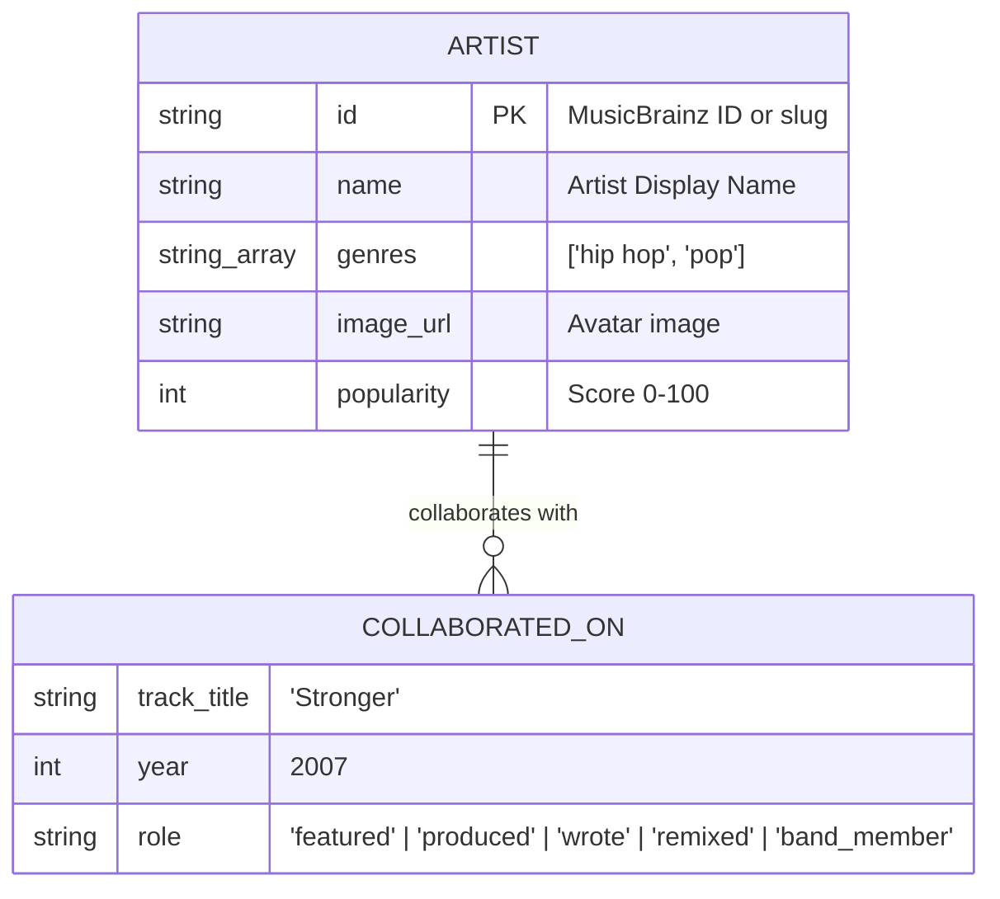

# Six Degrees — Music Artist Collaboration Graph

> A deterministic, high-performance graph application powered by CognoDB (openCypher over Bolt) and Neo4j driver.

---

## Concept & Use Case

"Six Degrees of Collaboration" is an interactive graph exploration platform that maps real-world musical collaborations — featured tracks, co-writes, production credits, remixes, and band memberships — to discover how any two musical artists are connected.

### Key Capabilities
- **6-Degrees Shortest Path Discovery**: Compute the shortest collaboration chain between any two artists in real time.
- **Interactive Force-Directed Network**: Full-bleed 2D graph with dynamic physics, genre color-coding, and focus lighting.
- **1-Hop Neighborhood Exploration**: Click any artist node to inspect degree centrality, popularity metrics, and direct collaborators.
- **Degree Centrality Hubs**: Rank the most-connected "hub" artists sitting at the center of the music industry.
- **Cross-Genre Bridges**: Discover artists sitting structurally between distinct genre clusters.

---

## Why a Graph Database? (Graph vs. Relational SQL)

Finding the shortest chain of collaborations between two arbitrary artists, out of an unknown number of intermediate hops, is a variable-length path problem.

### The Problem with Relational SQL (RDBMS)
In a relational database (PostgreSQL/MySQL), relationships are implicit foreign keys. A multi-hop traversal requires either:
1. N self-joins (hardcoded depth, breaks if depth is variable).
2. A Recursive Common Table Expression (CTE) that generates Cartesian products on intermediate join tables.

#### SQL Recursive CTE Example
```sql
WITH RECURSIVE artist_path AS (
  SELECT 
    artist1_id, 
    artist2_id, 
    ARRAY[artist1_id, artist2_id] AS path,
    1 AS depth
  FROM collaborations 
  WHERE artist1_id = $artistA_id

  UNION ALL

  SELECT 
    c.artist1_id, 
    c.artist2_id, 
    p.path || c.artist2_id, 
    p.depth + 1
  FROM collaborations c
  JOIN artist_path p ON c.artist1_id = p.artist2_id
  WHERE NOT c.artist2_id = ANY(p.path)
    AND p.depth < 6
)
SELECT * FROM artist_path 
WHERE artist2_id = $artistB_id 
ORDER BY depth ASC 
LIMIT 1;
```

---

### The Graph Approach (openCypher on CognoDB)
In CognoDB (openCypher), relationships are stored alongside nodes (Index-Free Adjacency). Traversing a relationship is an O(1) memory lookup rather than a table join.

#### Native Cypher Query
```cypher
MATCH p = shortestPath((a:Artist {name: $nameA})-[:COLLABORATED_ON*1..6]-(b:Artist {name: $nameB}))
RETURN [n IN nodes(p) | n.name] AS chain,
       [r IN relationships(p) | { track: r.track_title, year: r.year, role: r.role }] AS links;
```

#### Comparison Summary

| Metric | Relational Database (SQL) | Graph Database (CognoDB / Cypher) |
| :--- | :--- | :--- |
| **Path Traversal** | Recursive JOINs ($O(d^k)$) | Index-Free Adjacency ($O(1)$ per step) |
| **Variable Length Hops** | Recursive CTEs with depth limits | Expressive `[:COLLABORATED_ON*1..6]` pattern |
| **Schema Flexibility** | Rigid junction tables | Flexible node properties & directed/undirected edges |
| **Query Readability** | Multi-line CTE boilerplate | Single-line declarative `shortestPath()` |

---

## Data Model



---

## Main Cypher Queries Explained

### 1. Shortest Path (Multi-Hop)
```cypher
MATCH p = shortestPath((a:Artist)-[:COLLABORATED_ON*1..6]-(b:Artist))
WHERE toLower(a.name) = toLower($nameA) AND toLower(b.name) = toLower($nameB)
RETURN 
  [n IN nodes(p) | { id: n.id, name: n.name, genres: n.genres, popularity: n.popularity }] AS chain,
  [r IN relationships(p) | { track: r.track_title, year: r.year, role: r.role }] AS links
```

### 2. Direct 1-Hop Neighborhood
```cypher
MATCH (a:Artist)-[r:COLLABORATED_ON]-(other:Artist)
WHERE toLower(a.name) = toLower($artistName)
RETURN a, r, other
```

### 3. Degree Centrality (Hub Artists)
```cypher
MATCH (a:Artist)-[:COLLABORATED_ON]-(other:Artist)
RETURN a.id AS id, a.name AS name, a.genres AS genres, count(DISTINCT other) AS degree
ORDER BY degree DESC
LIMIT 10
```

### 4. Cross-Genre Bridge Artists
```cypher
MATCH (a:Artist)-[:COLLABORATED_ON]-(b:Artist)
UNWIND a.genres AS ownGenre
UNWIND b.genres AS connectedGenre
WITH a, ownGenre, connectedGenre WHERE ownGenre <> connectedGenre
WITH a, collect(DISTINCT connectedGenre) AS connectedGenres
WHERE size(connectedGenres) >= 2
RETURN a.name AS name, a.genres AS primaryGenres, connectedGenres, size(connectedGenres) AS diversityScore
ORDER BY diversityScore DESC
LIMIT 8
```

---

## Setup & Execution Guide

### Prerequisites
- Node.js >= v18.0.0
- npm >= v9.0.0

### Step 1: Provision CognoDB Instance
1. Access [console.cognodb.com](https://console.cognodb.com) and set up a graph instance.
2. Obtain connection details (`COGNODB_URI`, `COGNODB_USER`, `COGNODB_PASSWORD`).

### Step 2: Configure Environment Variables
Create `.env` in the root directory:
```env
COGNODB_URI=bolt+s://db-3bd9e34f.databases.cognodb.com
COGNODB_USER=cognodb
COGNODB_PASSWORD=your_password_here
PORT=5000
NODE_ENV=production
```

### Step 3: Install Dependencies
```bash
# Install backend dependencies
cd backend && npm install

# Install frontend dependencies
cd ../frontend && npm install
```

### Step 4: Seed Database
Populate CognoDB with artist and collaboration data using idempotent `MERGE` queries:
```bash
npm run seed
```

### Step 5: Start Application
```bash
# From root directory:
npm run dev
```
- **Frontend App**: `http://localhost:3000`
- **Backend API**: `http://localhost:5000/api`

---

## Technical Architecture & Design Choices

### 1. TanStack Query (React Query) for Server State
TanStack Query handles graph query execution, caching, and loading/error states. Custom hooks (`useShortestPath`, `useArtistNeighborhood`, `useHubArtists`) isolate data fetching from presentation logic and prevent redundant network requests.

### 2. Separation of Server State vs. UI State
Server state (graph entities from CognoDB) is managed by React Query. Local React component state handles ephemeral UI concerns (command palette visibility, modal toggles, hovered nodes).

### 3. Singleton Neo4j Driver Connection Pool
The backend initializes a single `neo4j.driver()` instance at application startup (`backend/src/config/db.ts`) with a tuned connection pool (`maxConnectionPoolSize: 50`) reused across HTTP requests.

### 4. Parameterized Cypher Execution
All Cypher queries utilize driver parameterization (`session.run(query, { nameA, nameB })`), avoiding string interpolation and enabling query plan caching in CognoDB.

### 5. Idempotent Graph Seeding via MERGE
Data ingestion uses openCypher `MERGE` patterns with `ON CREATE SET` and `ON MATCH SET` clauses to ensure repeatable execution without creating duplicate nodes or edges.

### 6. Component-Level Error Boundaries
Visualization views are wrapped in React `ErrorBoundary` components to handle canvas rendering exceptions gracefully without unmounting the main application layout.

---

## License
MIT License.
