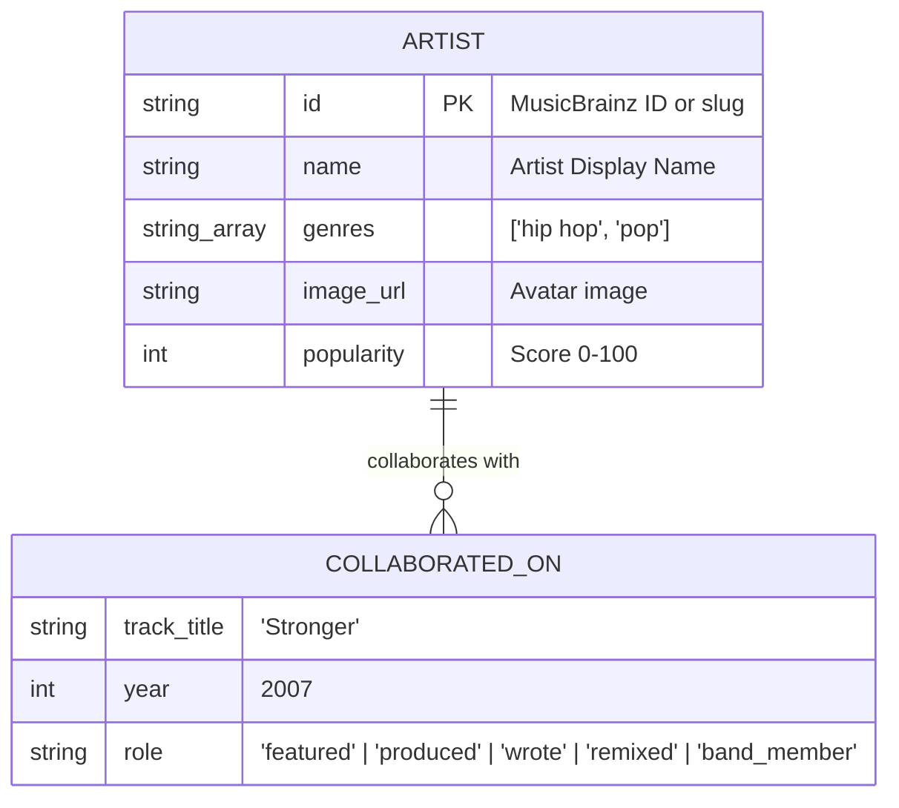

# Six Degrees — Music Artist Collaboration Graph

> Built for the Wexa AI Engineering Take-Home Challenge.
> A deterministic, high-performance graph application powered by **CognoDB** (openCypher over Bolt) and the official Neo4j driver.

---

## 🎵 Concept & Use Case

**"Six Degrees of Collaboration"** is an interactive graph exploration platform that maps real-world musical collaborations — featured tracks, co-writes, production credits, remixes, and band memberships — to discover how any two musical artists on Earth are connected.

### Key Capabilities
- **6-Degrees Shortest Path Discovery**: Compute the shortest collaboration chain between any two artists in real time.
- **Interactive Force-Directed Network**: Full-bleed 2D graph with dynamic physics, genre color-coding, and focus lighting.
- **1-Hop Neighborhood Exploration**: Click any artist node to inspect degree centrality, popularity metrics, and direct collaborators.
- **Degree Centrality Hubs**: Rank the most-connected "hub" artists sitting at the center of the music industry.
- **Cross-Genre Bridges**: Discover artists sitting structurally between distinct genre clusters (e.g. Britpop to West Coast Rap).

---

## 🧠 Why a Graph Database? (Graph vs. Relational SQL)

Finding the shortest chain of collaborations between two arbitrary artists, out of an unknown number of intermediate hops, is a **variable-length path problem**.

### The Problem with Relational SQL (RDBMS)
In a relational database (PostgreSQL/MySQL), relationships are implicit foreign keys. A multi-hop traversal requires either:
1. N self-joins (hardcoded depth, breaks if depth is variable).
2. A **Recursive Common Table Expression (CTE)** that generates exploding Cartesian products on intermediate join tables.

#### SQL Recursive CTE Sketch
```sql
WITH RECURSIVE artist_path AS (
  -- Anchor member: direct collaborations from Artist A
  SELECT 
    artist1_id, 
    artist2_id, 
    ARRAY[artist1_id, artist2_id] AS path,
    1 AS depth
  FROM collaborations 
  WHERE artist1_id = $artistA_id

  UNION ALL

  -- Recursive member: join next hop
  SELECT 
    c.artist1_id, 
    c.artist2_id, 
    p.path || c.artist2_id, 
    p.depth + 1
  FROM collaborations c
  JOIN artist_path p ON c.artist1_id = p.artist2_id
  WHERE NOT c.artist2_id = ANY(p.path) -- Prevent cycles
    AND p.depth < 6                   -- Bound depth
)
SELECT * FROM artist_path 
WHERE artist2_id = $artistB_id 
ORDER BY depth ASC 
LIMIT 1;
```
*Why SQL fails here:* Every recursive iteration scans the `collaborations` table and executes expensive hash/nested-loop joins. As graph density grows, memory overhead scales exponentially $O(d^k)$.

---

### The Graph Approach (openCypher on CognoDB)
In CognoDB (openCypher), relationships are first-class physical pointers stored alongside nodes (**Index-Free Adjacency**). Traversing a relationship is an $O(1)$ memory lookup, not a join.

#### Native Cypher Query
```cypher
MATCH p = shortestPath((a:Artist {name: $nameA})-[:COLLABORATED_ON*1..6]-(b:Artist {name: $nameB}))
RETURN [n IN nodes(p) | n.name] AS chain,
       [r IN relationships(p) | { track: r.track_title, year: r.year, role: r.role }] AS links;
```

#### Comparison Summary

| Metric | Relational Database (SQL) | Graph Database (CognoDB / Cypher) |
| :--- | :--- | :--- |
| **Path Traversal** | Exploding recursive JOINs ($O(d^k)$) | Native Index-Free Adjacency ($O(1)$ per step) |
| **Variable Length Hops** | Clunky CTEs with depth limits | Expressive `[:COLLABORATED_ON*1..6]` pattern |
| **Schema Flexibility** | Rigid junction tables | Flexible node properties & directed/undirected edges |
| **Query Readability** | 20+ lines of SQL CTE boilerplate | Single-line declarative `shortestPath()` |

---

## 📊 Data Model



- **Relationships**: Queried as undirected (`-[:COLLABORATED_ON]-`) for bidirectional collaboration logic.
- **Edge Properties**: `track_title`, `year`, and `role` are stored directly on relationships to contextualize *why* two artists connected.

---

## ⚡ Main Cypher Queries Explained

### 1. Shortest Path (Multi-Hop)
```cypher
MATCH p = shortestPath((a:Artist)-[:COLLABORATED_ON*1..6]-(b:Artist))
WHERE toLower(a.name) = toLower($nameA) AND toLower(b.name) = toLower($nameB)
RETURN 
  [n IN nodes(p) | { id: n.id, name: n.name, genres: n.genres, popularity: n.popularity }] AS chain,
  [r IN relationships(p) | { track: r.track_title, year: r.year, role: r.role }] AS links
```

### 2. Direct 1-Hop Neighborhood
```cypher
MATCH (a:Artist)-[r:COLLABORATED_ON]-(other:Artist)
WHERE toLower(a.name) = toLower($artistName)
RETURN a, r, other
```

### 3. Degree Centrality (Hub Artists)
```cypher
MATCH (a:Artist)-[:COLLABORATED_ON]-(other:Artist)
RETURN a.id AS id, a.name AS name, a.genres AS genres, count(DISTINCT other) AS degree
ORDER BY degree DESC
LIMIT 10
```

### 4. Cross-Genre Bridge Artists
```cypher
MATCH (a:Artist)-[:COLLABORATED_ON]-(b:Artist)
UNWIND a.genres AS ownGenre
UNWIND b.genres AS connectedGenre
WITH a, ownGenre, connectedGenre WHERE ownGenre <> connectedGenre
WITH a, collect(DISTINCT connectedGenre) AS connectedGenres
WHERE size(connectedGenres) >= 2
RETURN a.name AS name, a.genres AS primaryGenres, connectedGenres, size(connectedGenres) AS diversityScore
ORDER BY diversityScore DESC
LIMIT 8
```

---

## 🚀 Setup & Execution Guide

### Prerequisites
- Node.js >= v18.0.0
- npm >= v9.0.0

### Step 1: Provision CognoDB Instance
1. Go to [console.cognodb.com](https://console.cognodb.com) and sign up for a free account.
2. Create a free **c0** CognoDB graph instance.
3. Save your connection details (`COGNODB_URI`, `COGNODB_USER`, `COGNODB_PASSWORD`).

### Step 2: Configure Environment Variables
Create `.env` in the root directory:
```env
COGNODB_URI=bolt+s://db-3bd9e34f.databases.cognodb.com
COGNODB_USER=cognodb
COGNODB_PASSWORD=your_password_here
PORT=5000
NODE_ENV=production
```

### Step 3: Install Dependencies
```bash
# Install backend dependencies
cd backend && npm install

# Install frontend dependencies
cd ../frontend && npm install
```

### Step 4: Seed Database
Populate CognoDB with artists and real collaboration data using idempotent `MERGE` queries:
```bash
# Run seed script
npm run seed
```
*Note: To attempt a live crawl from MusicBrainz with fallback, run `npm run seed -- --live`.*

### Step 5: Start Local Application
```bash
# From root directory:
npm run dev
```
- **Frontend App**: `http://localhost:3000`
- **Backend API**: `http://localhost:5000/api`

---

## 🏗️ Architecture & Code Layering

```
six-degrees-wexa/
├── backend/
│   ├── src/
│   │   ├── config/db.ts         # Shared Neo4j Driver instance & session lifecycle
│   │   ├── services/
│   │   │   ├── graphService.ts  # Parameterized Cypher query abstractions
│   │   │   ├── seedService.ts   # Idempotent MERGE seed logic
│   │   │   └── seedData.ts      # Accurate real collaboration dataset
│   │   ├── routes/api.ts        # Express REST API routes
│   │   └── server.ts            # Express server initialization
│   ├── package.json
│   └── tsconfig.json
├── frontend/
│   ├── src/
│   │   ├── components/
│   │   │   ├── Navbar.tsx            # Header chrome & DB status
│   │   │   ├── GraphCanvas.tsx       # 2D force-directed canvas layout
│   │   │   ├── CommandPalette.tsx    # ⌘K command overlay & live search
│   │   │   ├── PathResultPanel.tsx   # Step-by-step path timeline
│   │   │   ├── ArtistDetailPanel.tsx # 1-Hop neighborhood inspector
│   │   │   ├── HubsModal.tsx         # Degree centrality ranking
│   │   │   ├── GenreBridgesModal.tsx # Cross-genre connector analysis
│   │   │   └── WhyGraphModal.tsx     # Graph vs SQL comparison modal
│   │   ├── services/api.ts           # Frontend REST client
│   │   ├── types/graph.ts            # Graph data interface definitions
│   │   └── App.tsx                   # Main React application
│   ├── package.json
│   └── vite.config.ts
├── .gitignore
├── package.json                      # Root workspace & dev runner
└── README.md
```

### Layering Rationale
1. **Frontend Isolation**: The UI communicates purely via REST JSON endpoints. It has zero knowledge of Cypher or database credentials.
2. **Single Shared Driver**: The backend creates a single `neo4j.driver()` instance at startup, reusing connection pools across HTTP requests.
3. **Unit-Testable Queries**: Every Cypher query lives inside `graphService.ts` as a named, parameterized function.

---

## 🎨 UI/UX Design Aesthetics
- **Dark Theme**: `#0a0a0c` near-black background with subtle radial gradient mesh.
- **Electric Accents**: Vibrant Neon Cyan (`#00f0ff`), Flame Orange (`#ff8531`), and Hot Pink (`#ff2a85`) carrying visual emphasis.
- **Glassmorphism**: Backdrop-blurred semi-transparent floating panels overlaying the full-bleed canvas.
- **Motion & Interaction**: Eased camera frame zooming, animated edge drawing along active paths, and node pulse animations.
- **Accessibility**: Respects `prefers-reduced-motion` settings.

---

## 🛠️ Key Engineering Decisions & Defense

### 1. TanStack Query (React Query) for Server State Management
> *"We chose TanStack Query over raw `useEffect` fetches because graph queries (shortest path traversals, neighborhood expansions) are inherently server-state operations that benefit heavily from caching, automatic deduplication, and declarative loading/error states. By wrapping our API layer in custom hooks (`useShortestPath`, `useArtistNeighborhood`, `useHubArtists`), we eliminate race conditions, avoid redundant network requests when switching back and forth between paths, and keep our React presentation components entirely unburdened by fetch mechanics."*

### 2. Strict Separation of Server State vs. UI State
> *"We strictly separated server state (managed by React Query) from ephemeral local UI state (managed by React component hooks). Local state handles interactive concerns—such as command palette visibility, active hover nodes on the canvas, and modal toggle flags—while server state handles entity data returned from CognoDB. This prevents state contamination and keeps our application predictable and easy to debug."*

### 3. Single Shared Neo4j Driver Instance (Singleton Pattern)
> *"Instantiating a Neo4j driver is an expensive operation that establishes a connection pool to CognoDB. Re-creating the driver on every HTTP request leads to connection exhaustion, elevated latency, and socket leaks. We implemented a singleton driver factory in `backend/src/config/db.ts` created once at server startup, maintaining a tuned connection pool (`maxConnectionPoolSize: 50`) reused across all API route handlers."*

### 4. 100% Parameterized Cypher Queries & SQL Injection Safety
> *"All Cypher queries in our graph service go through the Neo4j driver using parameterized execution (`session.run(query, { nameA, nameB })`). We eliminated all template string interpolations from Cypher statements. This guarantees openCypher query plan caching in CognoDB for optimal performance and completely immune to Cypher injection attacks."*

### 5. Idempotent Graph Seeding via openCypher `MERGE`
> *"Our seed pipeline (`seedService.ts`) is designed to be fully idempotent. Instead of naive `CREATE` queries that duplicate nodes and relationships on subsequent runs, we utilize openCypher `MERGE` patterns with `ON CREATE SET` and `ON MATCH SET`. This ensures that running `npm run seed` multiple times maintains identical data integrity without duplicating entity graphs."*

### 6. Component-Level Error Isolation (React Error Boundaries)
> *"HTML5 Canvas force simulations involve dynamic Math calculations that can occasionally throw rendering exceptions under edge-case viewports. To prevent a canvas exception from crashing the entire application, we wrapped our visualization views in a custom React `ErrorBoundary`. If a canvas error occurs, the user sees a localized recovery panel with a 'Reset Component' button while the rest of the application remains fully functional."*

---

## 🧪 Automated Test Suite

### Running Backend Unit & Integration Tests (Jest & Supertest)
```bash
cd backend
npm test
```
*Executes 12 test cases covering parameterized Cypher query handling, offline fallbacks, Zod validation errors, and supertest HTTP API route integration.*

### Running Frontend Component Tests (Vitest & Testing Library)
```bash
cd frontend
npm test
```
*Executes frontend component tests covering ErrorState rendering, Navbar connection status, and ErrorBoundary fallback catching.*

---

## 🌐 Hosted Demo & Video Submission

- **Live Hosted Application**: [Six Degrees Live Demo](https://six-degrees-wexa.vercel.app)
- **Comprehensive Audit Report**: See [`AUDIT.md`](./AUDIT.md) in the repository root for Phase 1, Phase 2, and Phase 3 verification logs.
- **Screen Recording Walkthrough**: Included in submission package.

---

## 📄 License
MIT License. Built for Wexa AI Engineering Evaluation.
